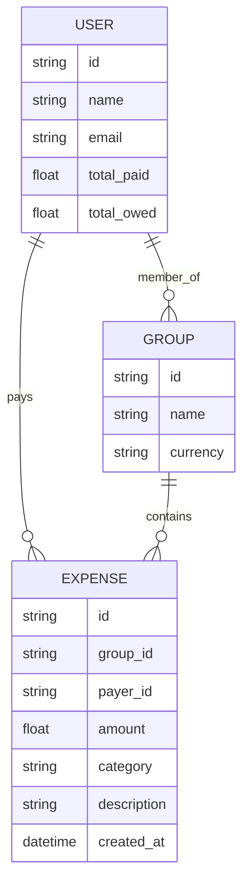

# SplitSphere (Hackathon Project)
### Product Requirements Document (PRD)
_Last Updated: October 2025_

---

## 🧠 Overview
**SplitSphere** is an AI-powered expense-sharing application that simplifies group payments through **voice**, **natural language**, and **automated settlement optimization**.

It helps groups of friends, travelers, or roommates **track shared expenses effortlessly** by allowing users to say or type messages like:
> “Add $45 for dinner paid by Dani for everyone.”

The system intelligently parses the statement, updates balances, and provides summaries and payment instructions — all through a conversational, human-like interface.

---

## 🎯 Objective
Develop a web or mobile app that:
- Tracks group expenses automatically through **voice or natural language input**
- Provides **AI-generated summaries** and fairness insights
- Calculates and optimizes **minimum-settlement transactions**
- Supports **voice interaction** with real-time feedback (TTS)
- Delivers a **fun, social, and frictionless** user experience

---

## 🧩 Core Features

### 1. AI Expense Logging
**Goal:** Allow users to record expenses using natural language or speech.

**Requirements:**
- Input can be **voice** or **text**.
- Parse details using an **NLP model** (Gemini API or OpenAI GPT).
- Extract entities: payer, amount, category, date, and involved users.
- Automatically associate expenses with a specific group.
- Provide confirmation via voice (ElevenLabs TTS) or chat message.

**Example Command:**
> “Add $60 for gas, paid by Franco, for Dani and Ana.”

---

### 2. Smart Balance Calculator
**Goal:** Maintain a running total of who owes who, and compute minimal settlement paths.

**Requirements:**
- Represent balances as a **directed weighted graph**.
- Implement an **optimized debt settlement algorithm**:
  - Minimize number of transactions.
  - Minimize total transferred value.
- Update balances automatically after each new expense.
- Store transaction history for audit and rollback.

**Output Example:**
```json
{
  "optimized_settlements": [
    { "from": "Ana", "to": "Dani", "amount": 45.50 },
    { "from": "Franco", "to": "Ana", "amount": 10.00 }
  ]
}
```

---

### 3. AI Group Summarizer
**Goal:** Generate automatic expense summaries and insights.

**Requirements:**
- Use LLM summarization to analyze spending data.
- Include:
  - Total group spend
  - Top spender
  - Who owes the most / least
  - Average per-person contribution
- Output both as text and structured JSON.
- Add a personality tone (formal, sarcastic, chill).

**Example Summary:**
> “Dani paid for 60% of total expenses. Ana owes $45, Franco owes $10. The trip cost $842 in total — hope it was worth it.”

---

### 4. Receipt & Transaction Parsing
**Goal:** Automatically extract data from receipts and emails.

**Requirements:**
- Accept image or PDF upload.
- Use OCR (Tesseract or Google Vision API).
- Detect amount, merchant, and date.
- Suggest payer based on history or metadata.
- Ask for confirmation before logging.

**Optional:** Integrate Gmail API for auto-import.

---

### 5. Chat Assistant Mode
**Goal:** Let users interact with the app through a conversational interface.

**Requirements:**
- Integrate a chat UI (React-based or API-driven).
- Parse casual messages for intent and entities.
- Respond contextually:
  - “How much do I owe Dani?”
  - “Show all payments for the last week.”
- Support both text and speech-to-text.

---

### 6. Auto Settlement Simulation (Prototype)
**Goal:** Simulate payment settlements using financial APIs.

**Requirements:**
- Integrate **Plaid** or **Capital One Sandbox API** (mock only).
- Generate settlement instructions.
- Display payment summary:
  > “Send $45 to Dani via bank transfer.”
- Log all transactions for later reference.

---

## 🌈 Fun / Differentiating Features

| Feature | Description |
|----------|-------------|
| **Group Personality Mode** | Choose a tone for AI (sarcastic, cheerful, formal). |
| **Emoji Stats Board** | Display roles like “💸 Big Spender” or “🫣 Moocher.” |
| **Trip Report Generator** | Automatically create a shareable recap (PDF/HTML). |
| **Voice Memory** | Users can ask, “Who still owes me from last time?” |
| **Smart Notifications** | Periodic reminders: “Franco still owes $10 👀.” |

---

## 🧰 Tech Stack

| Layer | Tool/Service |
|-------|---------------|
| Frontend | React / Next.js / React Native |
| Backend | Firebase Functions or Supabase Edge Functions |
| Database | PostgreSQL (via Supabase) |
| AI | Gemini API or OpenAI GPT API |
| Voice | ElevenLabs (TTS) + Whisper / SpeechRecognition (STT) |
| Payments | Plaid / Capital One sandbox (mock) |
| Hosting | Vercel (frontend), Firebase or Supabase (backend) |

---

## ⚡ MVP Scope
For the hackathon, focus on:
- [x] Create/join groups  
- [x] Add expenses via voice or chat  
- [x] View live balances and settlement suggestions  
- [x] Generate AI summaries  
- [x] (Optional) Voice feedback via ElevenLabs  

---

## 🧍 Target Users
- College students splitting rent or travel costs  
- Friends planning trips or events  
- Hackathon teams sharing meals or rides  

---

## 📈 Success Metrics
- **AI parsing accuracy** ≥ 85%  
- **Ease of use:** < 2 clicks or 1 command per expense  
- **Engagement:** ≥ 60% of users try voice or chat feature  
- **“Wow factor”** judged by hackathon panel feedback  

---

## 🛠️ Non-Functional Requirements
- **Performance:** Expense parsing under 1.5s latency  
- **Scalability:** Up to 500 concurrent users per group (Firebase test)  
- **Security:** Role-based access per group; token-based auth  
- **Reliability:** Handle offline mode and retry expense sync  
- **Localization:** Support USD and MXN initially  

---

## 🔮 Future Add-ons
- Real payment integration (Venmo, PayPal, Apple Pay)
- Expense analytics dashboard (charts, categories)
- Multi-currency support with live FX conversion
- Debt reminders via WhatsApp / Telegram bots
- Shared subscription management (Netflix, Spotify)

---

## 🧾 Example Data Model



---

## 🧑‍💻 Suggested Folder Structure
```
/splitsphere
 ┣ 📁 frontend/ (React or Next.js)
 ┃ ┣ pages/
 ┃ ┣ components/
 ┃ ┗ services/api.ts
 ┣ 📁 backend/
 ┃ ┣ functions/
 ┃ ┣ routes/
 ┃ ┗ utils/aiParser.js
 ┣ 📁 models/
 ┃ ┗ expenseSchema.ts
 ┣ 📁 integrations/
 ┃ ┣ elevenlabs/
 ┃ ┗ gemini/
 ┗ README.md
```

---

## 🏁 Summary Pitch (for Hackathon Demo)
> “Imagine you’re on a trip with friends — instead of typing into Splitwise, you just say:  
> ‘Hey SplitSphere, I paid $45 for dinner.’  
> The AI logs it, calculates who owes who, and at the end, tells you exactly who pays whom — with a single click. No spreadsheets, no math, just vibes.”

---

## ✅ Deliverables
- MVP web app or mobile prototype  
- Live demo showing:
  1. Voice-based expense entry  
  2. Real-time group balance update  
  3. AI-generated summary  
- Optional: fun group personality mode  

---
